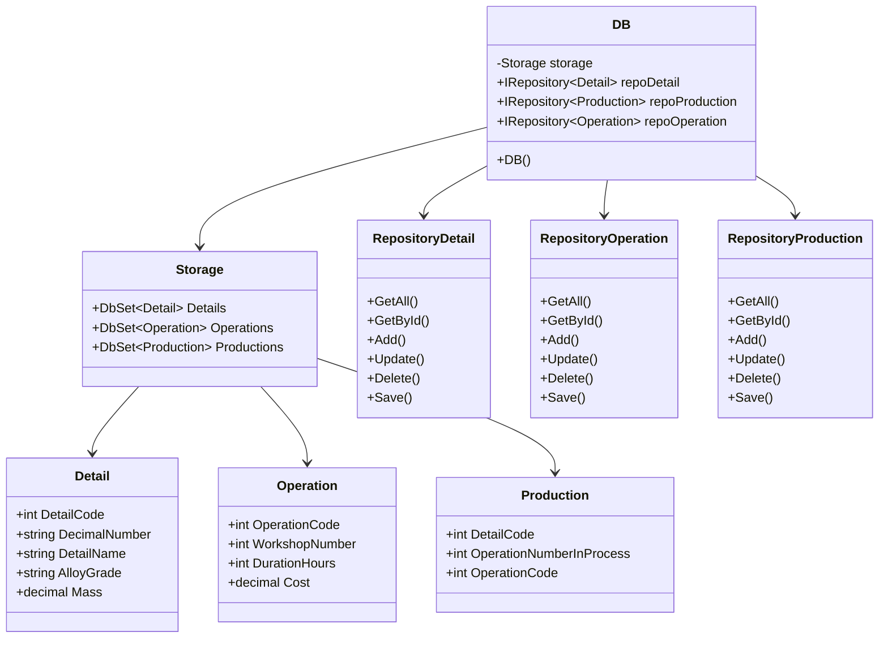
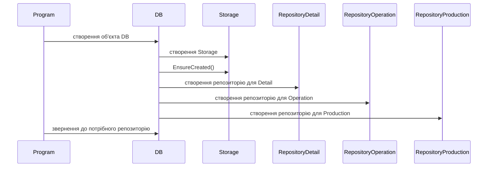
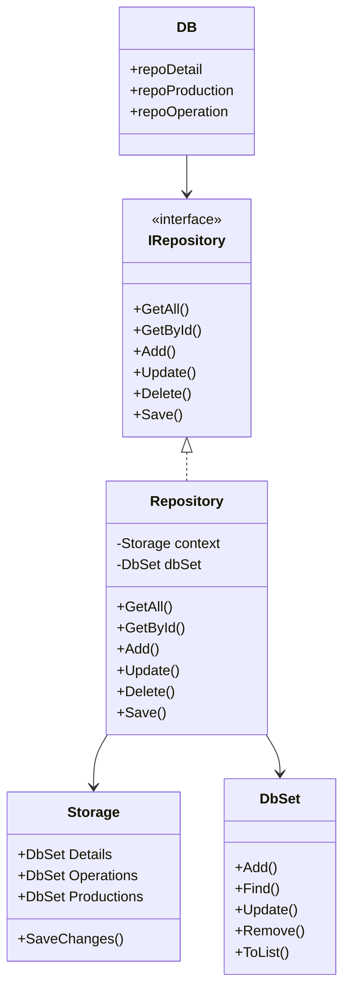
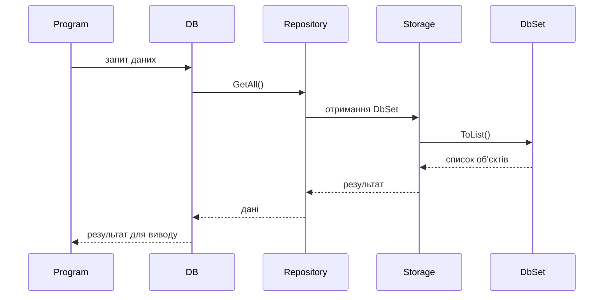
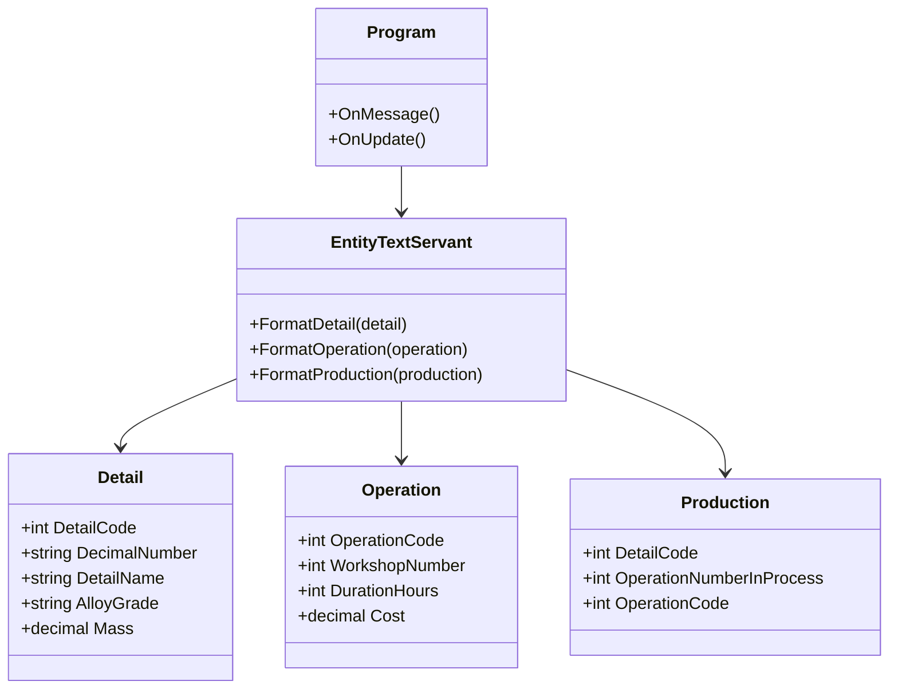
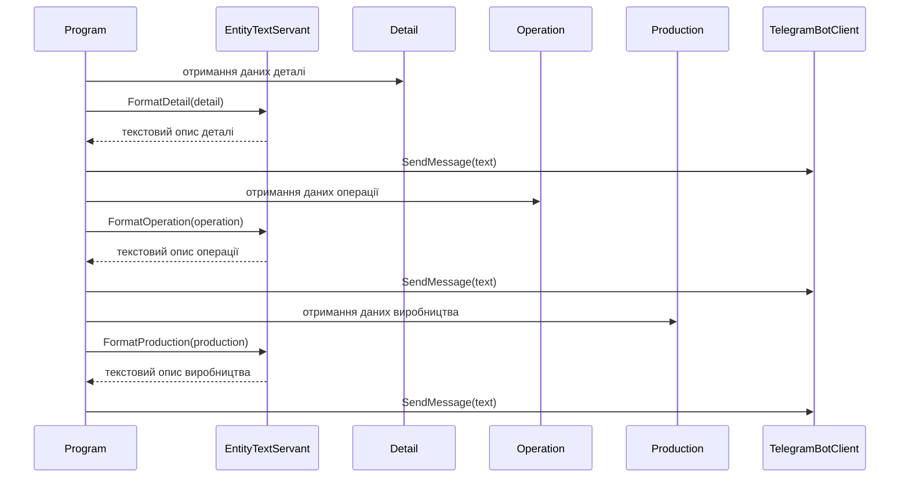
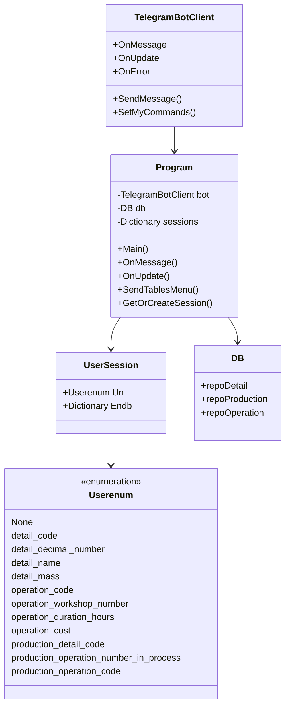
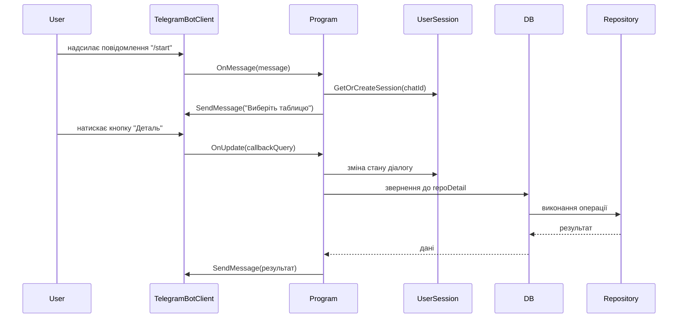

# Розрахунково-графічна робота
## Тема: Шаблони проектування

## Варіант
Група: 611пст.04

| Тип шаблону | Назва шаблону |
|---|---|
| Creational pattern | Multiton |
| Structural pattern | Adapter / Wrapper |
| Behavioral pattern | Design Servant |
| Concurrency pattern | Messaging |

## 1. Текстовий опис шаблонів проектування

### 1.1. Шаблон Multiton

Multiton — це породжувальний шаблон проектування, який є розвитком ідеї шаблону Singleton. Якщо Singleton дозволяє створити лише один екземпляр певного класу, то Multiton дозволяє створювати обмежену кількість екземплярів, кожен з яких пов’язаний з певним унікальним ключем.

Основна ідея шаблону полягає в тому, що об’єкти не створюються напряму через конструктор. Замість цього використовується спеціальний статичний метод, який перевіряє, чи існує вже об’єкт з потрібним ключем. Якщо такий об’єкт уже створено, метод повертає його. Якщо ні — створюється новий екземпляр, зберігається у внутрішній колекції та повертається користувачу.

Основні складові частини шаблону Multiton:

* клас Multiton — клас, який контролює створення власних екземплярів;
* приватний конструктор — забороняє створення об’єктів напряму ззовні;
* статична колекція екземплярів — зберігає створені об’єкти за ключем;
* ключ — унікальний ідентифікатор, за яким визначається потрібний екземпляр;
* статичний метод доступу — повертає існуючий об’єкт або створює новий.

Шаблон Multiton доцільно використовувати у випадках, коли в програмі потрібно контролювати кількість створених об’єктів одного типу. Наприклад, можна створювати окремі об’єкти підключення для різних баз даних, окремі менеджери для різних модулів системи або окремі конфігурації для різних режимів роботи програми.

Перевагою шаблону є централізоване керування екземплярами класу та зменшення дублювання об’єктів. Недоліком є те, що через використання статичного доступу може ускладнюватися тестування програми, а також з’являється залежність від глобального стану.

### 1.2. Шаблон Adapter / Wrapper

Adapter, або Wrapper, — це структурний шаблон проектування, який дозволяє об’єктам із несумісними інтерфейсами працювати разом. Він використовується тоді, коли вже існуючий клас має потрібну функціональність, але його інтерфейс не відповідає тому, який очікує клієнтський код.

Основна ідея шаблону полягає у створенні спеціального класу-адаптера. Цей клас реалізує інтерфейс, потрібний клієнту, але всередині себе викликає методи іншого, вже існуючого класу. Таким чином, клієнт працює з адаптером як зі звичайним об’єктом потрібного типу, а адаптер приховує від нього особливості старого або стороннього класу.

Основні складові частини шаблону Adapter / Wrapper:

* цільовий інтерфейс — інтерфейс, з яким хоче працювати клієнт;
* клієнт — частина програми, яка використовує цільовий інтерфейс;
* адаптований клас — існуючий клас із несумісним інтерфейсом;
* адаптер — клас, який перетворює виклики з цільового інтерфейсу у виклики методів адаптованого класу.

Шаблон Adapter часто використовується при підключенні старого коду до нової системи, інтеграції сторонніх бібліотек або зміні інтерфейсів без переписування вже готової логіки. Наприклад, стара платіжна система може мати метод MakePayment, а нова система очікує метод Pay. У такому випадку адаптер перетворює виклик Pay у виклик MakePayment.

Перевагою шаблону є можливість повторного використання вже існуючого коду без його зміни. Недоліком є поява додаткового класу-посередника, що може трохи ускладнити структуру програми.

### 1.3. Шаблон Design Servant

Design Servant — це поведінковий шаблон проектування, який використовується для винесення спільної поведінки групи класів в окремий службовий клас. Замість того щоб реалізовувати однакові методи в кожному класі окремо, створюється спеціальний клас-servant, який виконує потрібні операції над об’єктами, переданими йому як параметри.

Основна ідея шаблону полягає в тому, що об’єкти зберігають власну структуру і базову поведінку, а спільні або допоміжні дії виконує окремий службовий об’єкт. Це дозволяє уникнути дублювання коду та зробити програму більш гнучкою.

Основні складові частини шаблону Design Servant:

* servant-клас — службовий клас, який виконує спільні операції;
* обслуговувані класи — класи, над якими виконуються спільні дії;
* спільний інтерфейс — інтерфейс, який визначає можливості об’єктів, з якими працює servant;
* клієнтський код — частина програми, яка створює об’єкти та передає їх servant-класу для виконання операцій.

Шаблон Design Servant доцільно використовувати тоді, коли кілька різних класів потребують однакової поведінки, але цю поведінку не варто або неможливо винести у спільний батьківський клас. Наприклад, різні пристрої можуть мати методи увімкнення та вимкнення, а окремий службовий клас може виконувати їх перезапуск.

Перевагою шаблону є зменшення дублювання коду та винесення допоміжної логіки в окремий клас. Недоліком є те, що при надмірному використанні servant-клас може стати занадто великим і виконувати забагато різних обов’язків.

### 1.4. Шаблон Messaging

Messaging — це шаблон паралельних обчислень і взаємодії компонентів, який передбачає обмін даними між частинами програми за допомогою повідомлень. Замість прямого виклику методів одного об’єкта іншим, компоненти передають повідомлення через спеціальний канал, чергу або брокер повідомлень.

Основна ідея шаблону полягає у зменшенні прямої залежності між об’єктами. Відправник не обов’язково знає, хто саме обробить повідомлення, а отримувач не обов’язково знає, хто його створив. Це особливо корисно у багатопотокових, розподілених або асинхронних системах.

Основні складові частини шаблону Messaging:

* повідомлення — об’єкт або структура даних, яка містить інформацію для передачі;
* відправник — компонент, який створює та надсилає повідомлення;
* отримувач — компонент, який приймає та обробляє повідомлення;
* канал або черга повідомлень — проміжний механізм для зберігання та передачі повідомлень;
* брокер повідомлень — компонент, який керує передачею повідомлень між відправниками та отримувачами.

Шаблон Messaging застосовується у системах, де потрібно організувати асинхронну взаємодію між компонентами, розподілити навантаження або забезпечити незалежність частин програми. Наприклад, користувач може надсилати повідомлення до черги, а інший модуль програми поступово оброблятиме ці повідомлення.

Перевагою шаблону є слабка зв’язаність між компонентами, можливість асинхронної обробки та зручність масштабування. Недоліком є складніше відстеження потоку виконання програми, оскільки обмін відбувається не через прямі виклики, а через проміжний механізм повідомлень.

## 2. UML-моделі шаблонів проектування

### 2.1. UML-модель шаблону Multiton

У даному проєкті шаблон Multiton можна показати через клас DB, який створює та зберігає окремі репозиторії для різних типів сутностей. Для кожної таблиці бази даних використовується свій об’єкт репозиторію: для деталей, операцій та виробництва. Така структура дозволяє централізовано керувати доступом до різних наборів даних.

#### Статична модель Multiton

#### Динамічна модель Multiton

На статичній діаграмі показано, що клас DB містить окремі репозиторії для різних сутностей. Динамічна модель демонструє процес створення об’єкта DB, підключення до бази даних та ініціалізації репозиторіїв для подальшої роботи програми.

### 2.2. UML-модель шаблону Adapter / Wrapper

У даному проєкті шаблон Adapter / Wrapper реалізується через клас Repository. Він виступає обгорткою над засобами Entity Framework Core. Замість прямої роботи з DbSet клієнтський код використовує інтерфейс IRepository, який надає зрозумілі методи для виконання CRUD-операцій.

#### Статична модель Adapter / Wrapper

#### Динамічна модель Adapter / Wrapper

На статичній діаграмі показано, що Repository реалізує інтерфейс IRepository та приховує пряму роботу з DbSet. Динамічна модель показує, як клієнтський код звертається до репозиторію, а репозиторій всередині себе використовує Entity Framework Core для отримання даних.

### 2.3. UML-модель шаблону Design Servant

У даному проєкті шаблон Design Servant можна реалізувати через окремий службовий клас EntityTextServant. Цей клас виконує спільну допоміжну задачу для різних сутностей: Detail, Operation та Production. Він формує текстове представлення об’єктів, яке потім може використовуватися для відправлення користувачу в TelegramBot.

#### Статична модель Design Servant

#### Динамічна модель Design Servant

На статичній діаграмі показано службовий клас EntityTextServant, який працює з різними сутностями проєкту. Динамічна модель демонструє, що Program передає об’єкт у servant-клас, отримує готовий текст і відправляє його користувачу через TelegramBotClient.

### 2.4. UML-модель шаблону Messaging

У даному проєкті шаблон Messaging реалізується через TelegramBot. Користувач надсилає повідомлення боту, а клас Program приймає та обробляє їх за допомогою методів OnMessage і OnUpdate. Стан діалогу зберігається в UserSession, а доступ до даних виконується через клас DB.

#### Статична модель Messaging

#### Динамічна модель Messaging

На статичній діаграмі показано, що TelegramBotClient передає повідомлення в Program, а Program керує станом користувача через UserSession і звертається до бази даних через DB. Динамічна модель демонструє обмін повідомленнями між користувачем, ботом і програмною логікою. Таким чином, взаємодія з програмою відбувається через повідомлення, що відповідає шаблону Messaging.

## 3. Програмна реалізація шаблонів проектування

### 3.1. Реалізація шаблону Multiton

У проєкті шаблон Multiton демонструється через клас DB. Він створює окремі репозиторії для різних типів сутностей: Detail, Operation та Production. Для кожного типу даних використовується окремий об’єкт репозиторію, який зберігається всередині класу DB та повторно використовується під час роботи програми.

### 3.2. Реалізація шаблону Adapter / Wrapper

Шаблон Adapter / Wrapper реалізовано через інтерфейс IRepository та клас Repository. Клас Repository виступає обгорткою над DbSet з Entity Framework Core. Він приховує складні деталі роботи з базою даних і надає прості методи GetAll, GetById, Add, Update, Delete та Save.

### 3.3. Реалізація шаблону Design Servant

Шаблон Design Servant реалізовано через клас EntityTextServant. Цей клас виконує спільну допоміжну операцію для різних сутностей: Detail, Operation та Production. Він формує текстове представлення об’єктів, яке використовується для відправлення повідомлень користувачу через TelegramBot.

### 3.4. Реалізація шаблону Messaging

Шаблон Messaging реалізовано в проєкті TelegramBot. Користувач надсилає повідомлення або натискає кнопки, після чого TelegramBotClient передає ці дані в методи OnMessage або OnUpdate. Клас Program обробляє повідомлення, змінює стан користувача через UserSession і виконує потрібні операції з базою даних через DB.

## 4. Шаблони Visual Studio

Для кожного шаблону проектування було створено zip-файл, який може використовуватися як шаблон проєкту або елемента у середовищі Visual Studio.

Створені шаблони розміщено у папці Templates:

| Назва zip-файлу | Призначення |
|---|---|
| MultitonTemplate.zip | Шаблон для демонстрації патерну Multiton |
| AdapterWrapperTemplate.zip | Шаблон для демонстрації патерну Adapter / Wrapper |
| DesignServantTemplate.zip | Шаблон для демонстрації патерну Design Servant |
| MessagingTemplate.zip | Шаблон для демонстрації патерну Messaging |

Zip-файли були створені за допомогою інструмента Visual Studio Export Template. Для цього було використано пункт меню Project → Export Template, після чого обрано тип шаблону Project Template.
